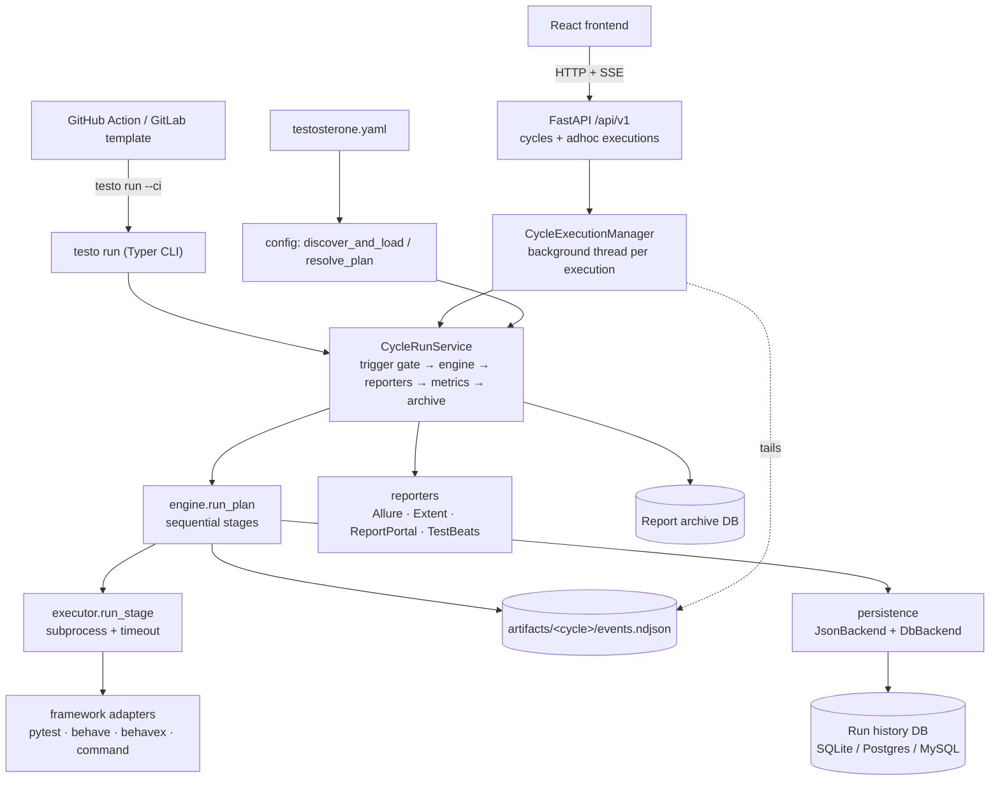

# Testosterone — Architecture

Testosterone (`testo-core`) runs multi-stage test **cycles** defined in `testosterone.yaml`
(pytest, Behave, BehaveX, or any command that writes JUnit XML), stores every run, and
turns the results into reports, dashboards, run-to-run deltas and AI failure summaries.

There is **one execution engine**. The CLI, the REST API and the React UI are thin
adapters over the same use case, `CycleRunService`, which drives the engine. Stages run as
host subprocesses; Docker is only used to host optional infrastructure (Postgres, MinIO,
Allure) and to package the CLI as a runner image.

## The big picture



## Layers

| Layer | Package | Responsibility |
|-------|---------|----------------|
| Configuration | `testo_core/config/` | Discover and parse `testosterone.yaml`; immutable `TestosteroneConfig` / `Plan` (cycle) / `Stage` dataclasses; `${env:…}` interpolation and `if:` filtering. |
| Use case | `testo_core/services/cycle_run.py` | `CycleRunService.run()`: trigger gate, engine call, configured reporters, native-report snapshot, metrics push, report archive. `single_stage_plan()` wraps one framework call as a one-stage `adhoc` cycle. |
| Engine | `testo_core/engine/` | `run_plan()` runs stages in order and emits typed events; `run_stage()` spawns the subprocess, tees `run.log`, enforces timeouts; `exit_codes.py` is the single exit-code taxonomy. |
| Framework adapters | `testo_core/frameworks/` | Build argv and Allure output dirs per framework. `command` runs any argv and imports its JUnit XML as Allure results. |
| Persistence | `testo_core/persistence/` | Best-effort backends behind one protocol: `plan_result.json` and a `RunRecord` row with health %, per-stage counts, failure evidence and CI provenance. |
| Storage | `testo_core/repository/`, `db.py` | Dialect-agnostic repository (SQLite default, Postgres/MySQL via `DATABASE_URL`). The only code that opens a database session. |
| Run history | `testo_core/history/` | Read side over stored runs: typed views, queries, report links and snapshot files. Reads through the repository only; MinIO lookups for pre-v1.1 runs are isolated in `s3_snapshots.py`. |
| Reporting | `testo_core/reporting/` | Collect Allure results from the artifacts tree; generate Allure / Extent / ReportPortal / TestBeats output; `testo report` commands. |
| Analytics | `testo_core/services/` | Dashboard rollups, run-to-run delta, AI failure analysis (bring-your-own-key providers in `services/ai/`). |
| Adapters | `testo_core/cli/`, `testo_api/`, `frontend/` | Presentation only: CLI renderers (Rich / NDJSON), FastAPI routes + SSE, React pages. |

## One run, end to end

1. **Entry.** `testo run --cycle smoke`, `POST /api/v1/cycles/smoke/executions`, or
   `POST /api/v1/adhoc-executions` (one framework, no cycle in YAML).
2. **Plan.** The config is loaded and the cycle resolved (or `single_stage_plan()` builds an
   `adhoc` plan). Stages whose `if:` is false are dropped.
3. **Trigger gate.** If the cycle has a `trigger:` block and `--force` is not set, changed
   paths are checked; a resting cycle exits `0` without running anything.
4. **Engine.** `run_plan()` runs each stage as a subprocess in its `target_repo`, writing
   `artifacts/<cycle>/<stage>/run.log` and Allure results, and appends every event to
   `artifacts/<cycle>/events.ndjson`. The CLI renders events live (Rich panels or NDJSON with
   `--ci`); the API tails `events.ndjson` and forwards each line as an SSE message.
   The API keeps running executions plus the last `TESTO_MAX_FINISHED_EXECUTIONS` (default
   200) finished ones in memory; older ones are only in the run history.
5. **Persist.** `JsonBackend` writes `plan_result.json`; `DbBackend` writes a `RunRecord`
   (status, durations, per-stage health, failed cases + traceback + log tail when the run
   failed, CI provider/commit/ref when run in CI). Failures here never fail the run.
6. **Post-run.** Configured reporters write per-run HTML under `static/history/<run_id>/`
   (served by the API at `/history`), native reports are copied next to them, KPIs are pushed
   to InfluxDB / a Prometheus Pushgateway when those are configured, and the cycle's report
   bundle is archived to the report DB (`testo report list/open/diff`).
7. **Read side.** The dashboard, Runs, Run Detail, Compare and AI summary endpoints all read
   the run history through `testo_core/history/` and the services on top of it.

## Interfaces

### CLI (`testo`)

`testo run`, `testo report …`, `testo cycles …`, `testo diff`, `testo summary`,
`testo config …`, `testo config-db`, `testo init`, `testo watch`, `testo doctor`, `testo clean`. Full reference: `docs/CLI Commands/Command Reference.md`.
`uqo` is a deprecated alias that forwards to `testo`.

Exit codes (`testo_core/engine/exit_codes.py`), propagated unchanged to CI:

| Code | Meaning |
|------|---------|
| `0` | Success, including a trigger-skipped cycle |
| `1` | Tests failed |
| `2` | Invalid config or CLI input |
| `3` | Infrastructure failure (timeout, missing executable, required archive failed) |
| `4` | Internal engine error |

### REST API (`testo_api/`, `/api/v1`)

| Area | Endpoints |
|------|-----------|
| Cycles | `GET /cycles`, `GET /cycles/{cycle}` |
| Executions | `POST /cycles/{cycle}/executions`, `POST /adhoc-executions`, `GET /cycle-executions/{id}`, `GET /cycle-executions/{id}/events` (SSE) |
| Runs | `GET /runs`, `GET /runs/{run_id}`, `GET /runs/{run_id}/reports`, `GET /runs/{run_id}/pyramid` |
| Analytics | `GET /analytics/delta`, `GET /analytics/delta/cases`, `GET /dashboard/overview`, `GET /dashboard/runs/recent` |
| AI | `GET /ai/config/status`, `PUT /ai/config`, `GET /runs/{run_id}/ai-summary`, `POST /runs/{run_id}/ai-summary:generate` |
| Health | `GET /health/live`, `GET /health/ready` |

Named-cycle and ad-hoc executions are the same resource: both return a
`/cycle-executions/{id}` status URL and event stream, and both run through `CycleRunService`.
Only one execution per cycle name (`adhoc` included) runs at a time; a second request gets `409`.

### Frontend (`frontend/`, Vite + React + Tailwind)

Dashboard (`/`), Cycles (`/cycles`, `/cycles/:name` with a live run panel), Runs (`/runs`,
`/runs/:runId`), Compare (`/compare`), Quick Run (`/quick-run`, one framework without a
cycle) and AI settings (`/settings/ai`). Pages only call typed `/api/v1` contracts; live
progress for both run panels comes from one hook, `features/execution/useCycleExecution.ts`.

### CI wrappers

`integrations/github-action/` (composite action) and `ci/gitlab/testo.gitlab-ci.yml` both run
`testo run --ci` and keep the NDJSON stream plus the final `plan_finished` event as artifacts.
`Dockerfile.testo-runner` packages the CLI as a runner image (`ENTRYPOINT ["testo"]`).

## Artifact layout

```text
artifacts/<cycle>/
  events.ndjson               # every engine event, append-only (tailed by the API)
  plan_result.json            # JsonBackend output
  <stage>/
    run.log
    allure-results/<framework>/*-result.json
static/history/<run_id>/      # per-run reporter output, served at /history
```

## Storage

- **Run history** (`RunRecord`, one row per cycle execution) is what every UI page and the
  delta/AI services read. Engine runs are written by `DbBackend`; records from the pre-v1.1
  headless runner are still readable (`history/views.py` normalises both shapes).
- **Report archives** (`ReportArchive`) are zipped report bundles keyed by their own UUID,
  written by `CycleRunService` after each run for `testo report list/open/diff`. They are not
  linked to a run id.
- `docker-compose.yml` provides Postgres for team setups plus MinIO and Allure Docker Service,
  which serve report snapshots of runs recorded before v1.1. New runs need none of them: the
  default database is SQLite and reports are served by the API.

## Design decisions

- **One engine, many adapters.** Every way of starting a run (CLI, API cycle, API ad-hoc,
  CI wrappers) goes through `CycleRunService`, so behaviour such as trigger gating, reporters
  and archiving cannot drift between surfaces. Until v1.1 a second, Docker-based stack
  (`HeadlessEngineService` → `runners.py`) and a Streamlit UI existed beside it; they were
  removed and their unique features (CI provenance, failure context, metrics push, ad-hoc
  runs) moved onto the engine.
- **One typed contract from Pydantic to React.** `testo_api/models.py` is the only place the
  HTTP contract is written. `scripts/export_openapi.py` exports FastAPI's OpenAPI schema to
  `frontend/openapi.json`, and `openapi-typescript` generates `frontend/src/lib/api-schema.ts`
  from it. CI fails if either file is stale or `tsc` finds a mismatch, so a backend change
  that breaks the UI fails the build instead of the browser.
- **Events as the integration seam.** The engine emits typed events; renderers decide
  presentation. `events.ndjson` doubles as the durable log the API streams from, so the API
  never holds run output in memory and the same file is available after the run.
- **Best-effort side effects.** Persistence, reporters, metrics pushes and archiving never
  change a run's exit code, except a required report archive under `--ci` (exit `3`).
- **Config is the source of truth.** Cycles, defaults, reporters and the database URL live in
  `testosterone.yaml`; the UI lists and runs what the file defines rather than keeping its own copy.

## Extending

- **New framework:** add an adapter in `testo_core/frameworks/` and its name to
  `SUPPORTED_FRAMEWORKS` in `config/schema.py`. For anything that writes JUnit XML, the
  `command` framework plus `junit_xml:` globs is usually enough.
- **New reporter:** implement it in `testo_core/reporting/reporters/` and register it in
  `SUPPORTED_REPORTER_TYPES`.
- **New persistence target:** implement `PersistenceBackend` (`persistence/backend.py`) and
  add it to `composite_backend()`.

Deeper notes live in the docs vault, starting at `docs/Index.md`
(`docs/Architecture/Architecture Overview.md`, `docs/Architecture/Deep Dive - Execution Logic.md`).
