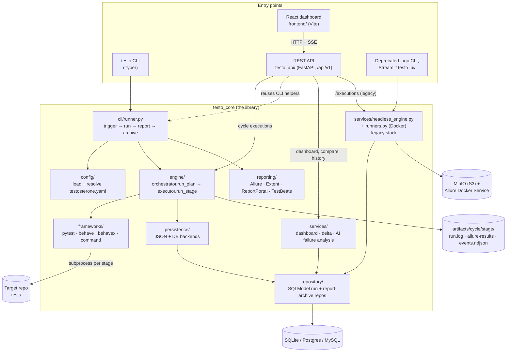

# Testosterone — Architecture

Testosterone (`testo-core`) is a config-driven test orchestrator. You describe test **cycles** in `testosterone.yaml`; each cycle is a list of **stages**, and each stage runs one test framework (pytest, Behave, BehaveX, or any command that writes JUnit XML). Testo runs the stages, collects every result into Allure format, writes run history, and produces reports. The same engine is driven from a CLI, a REST API, and a React dashboard.

This file is the map of the system as it is today. Deeper notes live in the docs vault: start at [docs/Index.md](docs/Index.md), then [Architecture Overview](docs/Architecture/Architecture%20Overview.md) and [Deep Dive - Execution Logic](docs/Architecture/Deep%20Dive%20-%20Execution%20Logic.md). Known structural debt is tracked in [Technical Debt Tracker](docs/Testing%20Workflows/Technical%20Debt%20Tracker.md).

## System diagram



Solid arrows are the main path. The dotted arrow is a known shortcut: the API imports helpers from the CLI module to run reporters and the report archive after a cycle (see [Known structural debt](#known-structural-debt)).

## Layers

| Layer | Package | Responsibility |
| --- | --- | --- |
| Entry points | `testo_core/cli/`, `testo_api/`, `frontend/` | Parse input, render output. The CLI is Typer with lazy command registration so `testo --help` stays fast. The API is FastAPI with one router per resource. The React app talks only to `/api/v1`. |
| Configuration | `testo_core/config/` | `loader.py` finds and parses `testosterone.yaml`, `schema.py` defines `TestosteroneConfig`, `Plan` (a cycle) and `Stage`, and `resolver.py` applies defaults and `${env:…}` interpolation. |
| Engine | `testo_core/engine/` | `orchestrator.run_plan()` runs stages in order and emits typed events (written to `events.ndjson`). `executor.run_stage()` spawns one subprocess per stage with a timeout and tees `run.log`. `exit_codes.py` is the single source of the 0–4 exit-code contract. |
| Framework adapters | `testo_core/frameworks/` | One `FrameworkAdapter` per `equipment` value. Each builds argv and says where Allure results land. `command` runs any argv and converts its JUnit XML into Allure results. |
| Reporting | `testo_core/reporting/` | Collects per-stage Allure results and generates reports. `reporters/` holds pluggable reporters selected by the `reporters:` block in config. |
| Persistence | `testo_core/persistence/`, `testo_core/repository/` | `PersistenceBackend` protocol with JSON and DB implementations fanned out by a composite backend. The DB side goes through a `BaseRunRepository` protocol backed by SQLModel, so SQLite, Postgres and MySQL all work. |
| Application services | `testo_core/services/` | Read-side use cases over run history: dashboard KPIs and trends, run-to-run delta comparison, and bring-your-own-key AI failure summaries (`services/ai/`, OpenAI and Anthropic providers). |

Dependency direction is outer to inner: entry points depend on `testo_core`; nothing in `testo_core` imports `testo_api`, `frontend` or Streamlit. Heavy dependencies (SQLAlchemy, Docker, FastAPI, Streamlit) are optional extras, and `import testo_core` loads none of them.

## How a cycle runs

1. `testo run --cycle sample-pytests` (or `POST /api/v1/cycles/{cycle}/executions` from the dashboard).
2. Config is discovered, validated and resolved into a `Plan` with its `Stage`s.
3. If the cycle has a `trigger:`, it is evaluated first and can skip the run.
4. `run_plan()` executes each stage. The adapter builds the command, the executor runs it in the stage's `target_repo` and streams events (`stage_started`, `log`, `stage_finished`, …) to a renderer: Rich panels on a terminal, NDJSON with `--ci`, or Server-Sent Events for the dashboard.
5. Results land in `artifacts/<cycle>/<stage>/`, and a `plan_result.json` summarises the cycle.
6. The persistence backend writes run history (JSON always, DB when configured).
7. Configured reporters run, and the report archive stores the cycle for later diffing.
8. The process exits with a contract exit code: `0` passed, `1` tests failed, `2` bad config, `3` infrastructure failure, `4` internal error.

## Design decisions

- **Config as the contract.** Cycles live in version-controlled YAML, so CI, the CLI and the dashboard all run exactly the same thing.
- **Host subprocesses by default.** The modern engine runs frameworks directly on the host. Docker execution belongs to the legacy stack and the published `testo-runner` image.
- **Sequential stages.** Stages run in order on purpose, which keeps logs, events and exit codes deterministic. Parallelism stays inside a framework (for example BehaveX `--workers`).
- **Allure as the common result format.** Every adapter, including the generic `command` adapter via JUnit import, produces Allure results, so every reporter works for every framework.
- **Events, not callbacks.** The engine emits typed events and a renderer decides the output. That is how the same run feeds a terminal, a CI log and a browser.
- **Protocols at the seams.** Framework adapters, persistence backends, repositories, reporters and AI providers are each a small `Protocol` with swappable implementations.

## Known structural debt

These are the main places where the code does not yet match the layering above. They are listed here so the picture is honest; the plan for each lives in the [Technical Debt Tracker](docs/Testing%20Workflows/Technical%20Debt%20Tracker.md).

- **Two execution stacks.** The modern engine (`engine/` + `frameworks/`) and the legacy stack (`services/headless_engine.py` + `runners.py` + `run_history.py`, Docker-based) both exist. The deprecated `uqo` CLI, the Streamlit UI and the API's `/executions` routes still use the legacy one.
- **The cycle use case lives in the CLI module.** `cli/runner.py` owns "trigger → run → report → archive", and `testo_api/cycle_execution_manager.py` imports its private helpers to do the same after an API run.
- **Overlapping persistence modules.** `persistence/`, `repository/`, `db.py`/`db_config.py` and the 900-line `run_history.py` all touch run storage.

---

# Legacy UQO platform (Docker runner)

Everything below describes the original UQO stack, which is still shipped for the deprecated `uqo` CLI, the Streamlit UI and the API's `/api/v1/executions` routes. New work should target the engine described above.

## Runtime services

`docker-compose.yml` defines the infrastructure expected by local development:

- **Postgres (`uqo-postgres`)**: canonical run lifecycle storage used by `testo_core/run_history.py`.
- **MinIO (`uqo-minio`)**: S3-compatible storage for raw results and report snapshots. The default bucket is `uqo-artifacts`.
- **MinIO init (`uqo-minio-init`)**: creates the bucket and sets anonymous download policy for report links.
- **Allure Docker Service (`uqo-allure`)**: renders `projects/<run_id>/reports/latest/index.html`.
- **Allure sync (`uqo-allure-sync`)**: continuously mirrors `s3://<bucket>/projects` into Allure's `/app/projects`.

The Streamlit UI (`testo-ui`), FastAPI (`uvicorn testo_api.main:app ...`), React frontend (`npm --prefix frontend run dev`), and CLI (`uqo run ...`) run on the host, not in Compose.

## Legacy source map

```text
.
├── testo_ui/                      # Deprecated Streamlit UI (`testo-ui`)
├── testo_api/                       # FastAPI adapter (JSON/SSE routes, execution manager)
├── frontend/                      # React dashboard consuming /api/v1 contracts
├── docker-compose.yml             # Postgres, MinIO, Allure, MinIO-to-Allure sync
├── testo_core/
│   ├── command_builders.py         # RunConfig, TestType, framework argv/env builders
│   ├── runners.py                  # Ephemeral Docker execution, audit workflow, log streaming
│   ├── run_history.py              # Postgres models, snapshots, S3 upload, history views
│   ├── cli/legacy.py               # Headless CLI adapter (`uqo run`)
│   ├── s3_client.py                # MinIO/S3 client and public object URLs
│   ├── report_generator.py         # Local Allure/static report generation and sync
│   ├── result_management.py        # Per-run result archive/cleanup
│   ├── integrations.py             # InfluxDB and Prometheus Pushgateway integration
│   └── services/                   # Shared application services (headless engine, config loader, delta analytics, UI helpers)
├── drop_in_hooks/                  # Framework helper modules injected via PYTHONPATH
├── sample_target_repo/             # Sandbox/demo target API and tests
├── scripts/write_allure_environment.py
└── tests/                          # Unit, integration, e2e, and contract test suites
```

Runtime output directories such as `artifacts/`, `logs/`, and `static/` are generated by runs and are not source-controlled API surfaces.

## Legacy execution flow

1. A host adapter (Streamlit, FastAPI, or CLI) builds run specs and calls `HeadlessEngineService`.
2. The engine validates inputs, creates Postgres run row(s) with `status=RUNNING`, and maps requests into `RunConfig`:
   - `test_type`: one of `pytest`, `behavex`, `behave_native`, or `locust`.
   - `target_repo`: host path to the target repo.
   - `shared_allure_results_dir`: usually `artifacts/allure-results/<test_type>`.
   - framework-specific args and optional Locust headless settings.
3. `testo_core.runners.run_streaming()` prepares the result directory, injects `UQO_RUN_ID`, and calls `build_command()`.
4. The runner starts a container on Docker network `uqo-net` (default image `python:3.11-slim`, override via `UQO_RUNNER_IMAGE`), mounts the orchestrator repo to `/app`, and executes the command.
   - Legacy mode installs `requirements.txt` at runtime.
   - Prebuilt mode (`UQO_RUNNER_PREBUILT=true` or auto with a custom image) skips runtime dependency installation.
5. Container logs are streamed to the adapter and written under `logs/<run_id>.log`.
6. After completion, framework-specific fixups run:
   - BehaveX JSON may be copied from known BehaveX output locations into the shared Allure directory.
   - Locust HTML is mirrored from the isolated results directory into the artifacts/static layout.
7. Reports are synchronized into `static/`, run metadata is persisted, raw Allure results are uploaded to `projects/<run_id>/results/`, and report snapshots are uploaded under `runs/<run_id>/artifacts/`.
8. `uqo-allure-sync` mirrors `projects/` from MinIO into Allure Docker Service. The UI links to `ALLURE_SERVER_URL/allure-docker-service/projects/<run_id>/reports/latest/index.html`.

## Headless CLI output + exit-code contract

`uqo run --config <path>` resolves execution mode with this precedence:

- `--no-ghost` disables ghost mode
- `--ghost` enables ghost mode
- `--ci` enables ghost mode (legacy-compatible)
- otherwise CI env auto-detection enables ghost mode when recognized

Ghost mode guarantees machine-readable stdout:

- With `--json`: one final summary JSON object.
- With `--stream-json`: NDJSON event objects followed by final summary JSON (always).

Exit code mapping:

- `0`: successful run
- `1`: run executed but domain test/audit failed
- `2`: invalid config/arguments
- `3`: infrastructure/runtime dependency failure (e.g. docker/runtime failures)
- `4`: unexpected internal error

The engine enriches metadata with provenance fields:

- `trigger_source` (`ui`, `cli`, or `ci`)
- `ci_mode` (boolean)
- `execution_mode` (`headless` or `ghost`)
- `schema_version` (current engine schema marker)
- provider metadata when available (`ci_provider`, `ci_pipeline_id`, `ci_job_id`, `ci_commit_sha`, `ci_ref_name`)

Stable `schema_version=1` summary payload keys:

- `schema_version`, `trigger_source`, `ci_mode`, `persist`
- `exit_code`, `aggregate_returncode`
- `started_at`, `finished_at`, `duration_s`
- `runs`, `error`
- `execution_mode`, `failure_type`, `sync`

Contract scope note:

- The machine-readable contract is guaranteed for the `uqo run ...` command path.
- Argument parser failures before command execution can emit argparse help text on stderr.

Adapter migration status:

- Streamlit and CLI run execution both delegate to `HeadlessEngineService`.
- FastAPI execution also delegates to `HeadlessEngineService` and emits transport events over SSE.
- Legacy unused Streamlit worker helpers that directly orchestrated `run_streaming`/`AuditService` were removed to prevent orchestration drift.

## Framework command contract

`testo_core.command_builders.RunConfig` is the public shape for runner command construction.

| `TestType` | Command behavior |
| --- | --- |
| `PYTEST` | Runs `pytest <pytest_args> --alluredir <shared_dir>`. |
| `BEHAVEX` | Runs `behavex`, strips user-provided `-o/--output-folder`, writes native output to `artifacts/behave_reports`, and adds the BehaveX Allure formatter unless a formatter is already present. |
| `BEHAVE_NATIVE` | Runs `behave -f allure_behave.formatter:AllureFormatter -o <shared_dir>` and defaults to `<target_repo>/features` when no explicit feature target is supplied. |
| `LOCUST` | Runs `locust` with the target locustfile plus `drop_in_hooks/locust_custom/locust_hooks.py`; headless defaults add users, spawn rate, runtime, summary, and an HTML report path when not supplied. |

The runner injects these common variables:

- `UQO_SHARED_ALLURE_RESULTS_DIR`: framework output path, rewritten to a container path for Docker execution.
- `UQO_RUN_ID`: stable run identifier for metadata and result isolation.
- `UQO_LAST_TEST_TYPE`: selected framework string for downstream hooks/labels.
- `PYTHONPATH`: orchestrator root and `drop_in_hooks/`, so target runs can import helper modules without copying them.

Only environment keys with prefixes `UQO_`, `AWS_`, `S3_`, `MINIO_`, plus `SUT_URL`, are propagated into the Docker container.

## Audit workflow

`testo_core.runners.run_audit_streaming()` executes phases in one logical run:

1. Pytest
2. BehaveX
3. Optional native Behave
4. Locust

Each phase writes to `artifacts/allure-results/<framework>/`. A non-zero phase is logged and the remaining phases continue, so audit reports can show partial coverage. The aggregate return code is `0` only when every phase succeeds. The health score is computed from generated Allure results.

## Artifact and history layout

- Raw local results: `artifacts/allure-results/<framework>/`.
- Archived previous local results: `artifacts/allure-results-archive/<timestamp>_<run_id>/`.
- Local static report mirrors: `static/allure_reports/<framework>/index.html`, `static/locust_report.html`, and `static/behave/`.
- MinIO raw results for Allure Docker Service: `projects/<run_id>/results/<files>`.
- MinIO downloadable snapshots: `runs/<run_id>/artifacts/...`.

`testo_core/run_history.py` stores run metadata in Postgres and builds history links from either local static history or MinIO snapshot prefixes.

## Delta comparison analytics

- Core source of truth: `testo_core/services/delta_service.py`.
- Delta endpoint: `GET /api/v1/analytics/delta?current_run_id=...&baseline_run_id=...`.
- Frontend adapter: `frontend/src/features/compare/ComparePage.tsx` with API wiring in `frontend/src/lib/api-client.ts`.
- Deterministic direction/classification policy table: [Delta Comparison Policy](docs/Release%20Management/Delta%20Comparison%20Policy.md).

## Unified dashboard architecture

- Core aggregation source of truth: `testo_core/services/dashboard_service.py`.
- Dashboard API adapter: `testo_api/routes/dashboard.py`.
- Dashboard frontend entrypoint: `frontend/src/features/dashboard/DashboardPage.tsx` (route `/`).
- API contracts:
  - `GET /api/v1/dashboard/overview`
  - `GET /api/v1/dashboard/runs/recent`
- Aggregation boundary:
  - Core/backend computes headline KPIs, trends, reliability/performance rollups, report-link states, and freshness/degraded notes.
  - React remains presentation-only over typed `/api/v1` contracts.
- KPI semantics:
  - health trend uses `higher_is_better`
  - failed-count trend uses `lower_is_better`
  - duration trend uses `lower_is_better`
- Backward compatibility:
  - Existing pages and routes (`/execution`, `/history`, `/compare`, `/runs/:runId`) remain valid.
  - Existing endpoints (`/api/v1/runs*`, `/api/v1/analytics/delta`) remain additive-only and unchanged.

## Phase 4 BYOK failure analysis architecture

- Core AI provider boundary lives in `testo_core/services/ai/`:
  - provider protocol + typed config (`config.py`, `provider_base.py`)
  - pluggable adapters (`providers/openai_provider.py`, `providers/anthropic_provider.py`)
  - provider factory (`factory.py`)
- Failure summarization remains core-owned in:
  - `testo_core/services/failure_context_builder.py`
  - `testo_core/services/failure_analysis_service.py`
- Summary persistence is additive-only in run metadata (`metadata_.ai_summary_v1`), preserving existing run schema contracts.
- API adapter surface (`testo_api/routes/ai.py`) is intentionally thin:
  - `GET/PUT /api/v1/ai/config...`
  - `GET/POST /api/v1/runs/{run_id}/ai-summary...`
- UI surface remains presentation-only:
  - settings: `frontend/src/features/settings/AIIntegrationSettingsPage.tsx`
  - run details summary card: `frontend/src/features/run-detail/RunDetailPage.tsx`

Security model:

- explicit feature opt-in
- no secret echo in API payloads
- runtime-input key path is memory-only by default
- token redaction utility applied before error propagation
- deterministic context budget/truncation for prompt construction

## Operational notes

- Start infrastructure with `docker compose up -d` and verify `docker compose ps` before launching the legacy stack.
- The execution container uses Docker network `uqo-net`; Compose must be running so the network exists.
- If Allure links 404 immediately after a run, wait for the 5-second `allure-sync` mirror loop, then check that MinIO contains `projects/<run_id>/results/` and `uqo-allure-sync` is healthy.
- If history downloads or S3 snapshots are missing, verify `MINIO_ROOT_USER`, `MINIO_ROOT_PASSWORD`, `BUCKET_NAME`, and optionally `MINIO_PUBLIC_BASE_URL`.
- Metrics pushes are optional. Configure `INFLUXDB_URL`, `INFLUXDB_TOKEN`, `INFLUXDB_ORG`, `INFLUXDB_BUCKET`, and/or `PROMETHEUS_PUSHGATEWAY_URL` plus optional `PROMETHEUS_JOB_NAME`.
