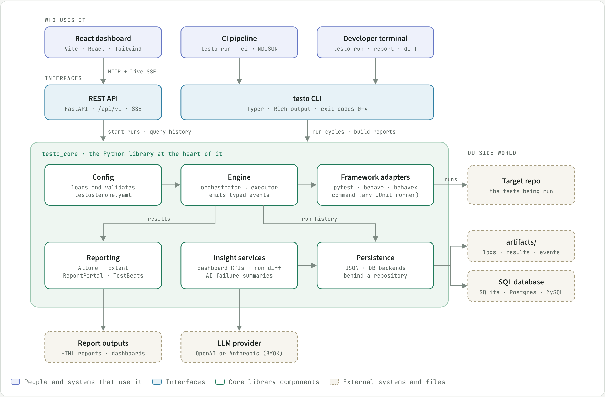

# Testosterone

**One YAML file to run your whole test cycle (pytest, Behave, BehaveX or any JUnit-writing command), then see what changed since the last run.**

[](https://github.com/taltal-beep/testosterone/actions/workflows/ci.yml)
[](https://github.com/taltal-beep/testosterone/actions/workflows/pages-demo.yml)

[](LICENSE)

**Live demo: <https://taltal-beep.github.io/testosterone/>**

<!-- screenshots: added after the demo fixes land -->

What you're looking at: Testosterone testing itself (its own 559-test suite) and `fake-api`, a
small app whose routes fail on purpose. CI runs both cycles and publishes the real results as a
read-only static site.

## Why

Most projects run several test frameworks, each with its own command, report format and CI
glue. Testosterone puts them in one `testosterone.yaml` as a **cycle** of stages, runs it, records
every run, and answers the question you actually have after a red build: *what changed?* You get
run-to-run deltas, a test pyramid, and an optional AI summary of the failures. The same engine
runs the cycle whether you start it from the CLI, from CI, or from the web UI.

**How it compares.** Allure and ReportPortal display the results of a run someone else
started. Testosterone starts the run: it orchestrates the stages, keeps the history and diffs
runs against each other, then hands results to Allure, ReportPortal, Extent or TestBeats as
reporters. It sits upstream of those tools rather than replacing them.

<picture>
  <source media="(prefers-color-scheme: dark)" srcset="docs/assets/testosterone-architecture-dark.png">
  
</picture>

What ships: the `testo` CLI (`--ci` streams NDJSON events, exit codes `0`–`4`), a FastAPI
backend (`testo_api`, `/api/v1`, live runs over server-sent events), a React frontend
(`frontend/`), and GitHub Action / GitLab CI wrappers around `testo run --ci`. See
[ARCHITECTURE.md](ARCHITECTURE.md) for how the pieces fit.

## Quickstart

```bash
git clone https://github.com/taltal-beep/testosterone.git
cd testosterone
python -m venv .venv && source .venv/bin/activate
pip install -e ".[dev]"

testo run --cycle sample-pytests      # run a cycle from testosterone.yaml
testo report --cycle sample-pytests   # build the Allure report for it
```

Runs are stored in SQLite by default (`database.url` in `testosterone.yaml`, or
`DATABASE_URL`). Postgres and MySQL work too; `docker compose up -d postgres` starts one.

### UI

```bash
testo-api                              # FastAPI on http://127.0.0.1:8000
npm --prefix frontend install
npm --prefix frontend run dev          # React on http://localhost:5173
```

Pages: Dashboard, Cycles (run any cycle and watch its stages live), Runs and Run Detail
(reports, test pyramid, AI summary), Compare (delta between two runs), Quick Run (run one
framework against a repo without defining a cycle) and AI settings.

## Defining cycles

```yaml
version: 1
defaults:
  target_repo: .
  artifacts_root: artifacts
  timeout_s: 600
reporters:
  - type: allure
cycles:
  smoke:
    description: Unit tests, then BDD flows.
    trigger:                     # optional: skip unless these paths changed
      paths: ["src/**", "tests/**"]
    stages:
      - name: unit
        equipment: pytest
        args: [-q, tests/unit]
      - name: flows
        equipment: behave
        args: [features/smoke.feature]   # always target Behave features explicitly
      - name: web
        equipment: command               # any runner; results come from JUnit XML
        args: [npx, jest, --ci]
        junit_xml: ["reports/junit/*.xml"]
```

`testo config validate` checks the file; `testo init` writes one interactively. The full
schema and every flag are in [Command Reference](docs/CLI%20Commands/Command%20Reference.md).

## CLI

| Command | What it does |
|---------|--------------|
| `testo run --cycle <name>` | Run a cycle (`--ci` NDJSON, `--stream` live output, `--force` ignore triggers, `--no-persist`) |
| `testo report …` | Generate, list, open and export reports (`testo diff` compares two archived runs) |
| `testo cycles list/show` | Inspect configured cycles |
| `testo watch --cycle <name>` | Re-run a cycle when files change |
| `testo doctor` | Check config, database and tools on PATH |

Exit codes: `0` success (or trigger-skipped), `1` tests failed, `2` invalid input,
`3` infrastructure failure, `4` internal error.
Details: [Troubleshooting and Error Codes](docs/CLI%20Commands/Troubleshooting%20and%20Error%20Codes.md).

## API

| Area | Endpoints (`/api/v1`) |
|------|-----------------------|
| Cycles | `GET /cycles`, `GET /cycles/{cycle}` |
| Executions | `POST /cycles/{cycle}/executions`, `POST /adhoc-executions`, `GET /cycle-executions/{id}`, `GET /cycle-executions/{id}/events` (SSE) |
| Runs | `GET /runs`, `GET /runs/{id}`, `GET /runs/{id}/reports`, `GET /runs/{id}/pyramid` |
| Analytics | `GET /analytics/delta`, `GET /analytics/delta/cases`, `GET /dashboard/overview`, `GET /dashboard/runs/recent` |
| AI (bring your own key) | `GET /ai/config/status`, `PUT /ai/config`, `GET /runs/{id}/ai-summary`, `POST /runs/{id}/ai-summary:generate` |
| Health | `GET /health/live`, `GET /health/ready` |

Interactive docs at `http://127.0.0.1:8000/docs` while `testo-api` runs.

## CI

GitHub Actions:

```yaml
- uses: taltal-beep/testosterone/integrations/github-action@v1
  with:
    cycle: smoke          # optional: config-path, ci-mode, persist, python-version
```

GitLab CI (a GitLab mirror of this repo is coming; until then, include the template straight
from GitHub, or copy [ci/gitlab/testo.gitlab-ci.yml](ci/gitlab/testo.gitlab-ci.yml)):

```yaml
include:
  - remote: "https://raw.githubusercontent.com/taltal-beep/testosterone/v1/ci/gitlab/testo.gitlab-ci.yml"
variables:
  TESTO_CYCLE: "smoke"
```

Both run `testo run --ci`, keep the NDJSON event stream, and expose the final `plan_finished`
event (exit code, per-stage results). Run records written in CI carry the provider, pipeline,
job, commit and branch. Inputs and outputs: [integrations/github-action/README.md](integrations/github-action/README.md).

## Optional integrations

- **Metrics push:** after each run, test KPIs go to InfluxDB when `INFLUXDB_URL`,
  `INFLUXDB_TOKEN`, `INFLUXDB_ORG` and `INFLUXDB_BUCKET` are set, and to a Prometheus
  Pushgateway when `PROMETHEUS_PUSHGATEWAY_URL` is set (`PROMETHEUS_JOB_NAME` defaults to `uqo`).
  Pushes are best-effort and never change the run result.
- **Reporters:** `allure`, `extent`, `reportportal`, `testbeats` under `reporters:`.
- **AI failure summaries:** opt in on the AI settings page with an OpenAI or Anthropic key.
  Failed runs store their failing cases, first traceback and log tail (redacted), which is
  what the summary is built from.

## Development

```bash
pip install -e ".[dev]"
pre-commit install
ruff check .
ruff format --check .
mypy testo_core
pytest -q -m "tier_fast and not quarantined" --no-cov
npm --prefix frontend run typecheck
npm --prefix frontend test
```

`ruff check`, `ruff format --check` and `mypy testo_core` are all blocking in CI
(`.github/workflows/ci.yml`'s `format` job), as are the frontend typecheck and tests.

See [CONTRIBUTING.md](CONTRIBUTING.md) for the full checklist. Start with
[ARCHITECTURE.md](ARCHITECTURE.md) for the design; [docs/](docs/Index.md) holds internal design
notes and ADRs (an Obsidian vault, so some links only resolve inside Obsidian).

## History

The project started as UQO ("Unified Quality Orchestrator") and was renamed to Testosterone;
the `uqo` command still works as a deprecated alias for `testo`. v1.1 replaced the Streamlit UI
with the React frontend and dropped the Docker-based headless runner (stages now run as host
subprocesses). Full details in [CHANGELOG.md](CHANGELOG.md).

<details>
<summary>Migrating from v1.0</summary>

| v1.0 | v1.1 |
|------|------|
| Streamlit UI (`testo-ui`, `streamlit run app.py`) | React frontend (`frontend/`) |
| `uqo run --config runs.yaml` (`runs:` list of `test_type`/`cli_args`) | a cycle in `testosterone.yaml`, run with `testo run --cycle <name>` |
| `--ghost`, `--json`, `--stream-json` | `--ci` (NDJSON events, `plan_finished` last) |
| `POST /api/v1/executions` + `/executions/{id}/events` | `POST /api/v1/adhoc-executions` (one framework) or `POST /api/v1/cycles/{cycle}/executions`; status and SSE under `/cycle-executions/{id}` |
| "Legacy Execution" page | Quick Run (`/quick-run`) |
| Tests run in one-off Docker containers (`UQO_RUNNER_IMAGE`, `UQO_RUNNER_PREBUILT`) | stages run as host subprocesses; use `Dockerfile.testo-runner` as the CI job image if you want isolation |
| Allure results uploaded to MinIO per run | per-run reports under `static/history/<run_id>/` (served at `/history`) and the report archive DB; pre-v1.1 runs keep their MinIO links |
| `locust` test type | `equipment: command` with `args: [locust, --headless, …]` |
| Pluggy `plugins/*.py` runner hooks | a framework adapter in `testo_core/frameworks/` |

</details>
