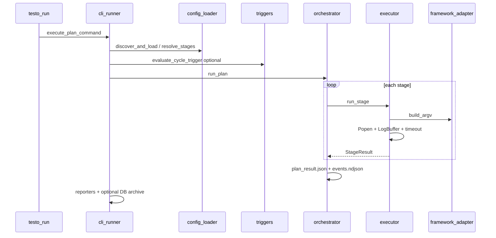

# Deep Dive — Execution Logic

[[Architecture Overview]]

This note maps how **Testo** (`testo run`) initializes a test session, executes it stage-by-stage on the host, preserves state, and tears down. It is the implementation companion to [[Architecture Overview]] and [[QA Strategies]].

The default path uses **host subprocesses** — no Docker. The legacy **UQO headless** stack (`uqo run`, `testo_core/runners.py`, `HeadlessEngineService`) is documented briefly at the end.

---

## Executive summary

| Property | Behavior |
|----------|----------|
| Entry | `testo run` → Typer → `execute_plan_command` |
| Config | `testosterone.yaml` (or discovery chain) |
| Execution unit | **Cycle** (plan) → ordered **stages** |
| Stage runtime | One `subprocess.Popen` per stage |
| Stage ordering | **Strictly sequential** in `run_plan()` |
| Parallelism | Framework-internal only (e.g. BehaveX `--workers`) |
| Durability | `artifacts/<cycle>/` — logs, NDJSON events, Allure JSON |
| Exit codes | `EngineExitCode` 0–4 via `classify_exit_code()` |

---

## End-to-end lifecycle



### Phase map

| Phase | Module | What happens |
|-------|--------|----------------|
| 1. CLI parse | `testo_core/cli/commands/run.py` | Validates flags; defers heavy imports |
| 2. Config load | `testo_core/config/loader.py` | `discover_and_load()` → `TestosteroneConfig` |
| 3. Plan resolve | `testo_core/config/resolver.py` | `resolve_plan()` / `resolve_stages_for_plan()` |
| 4. Trigger gate | `testo_core/triggers.py` | Optional skip (exit 0) unless `--force` |
| 5. Renderer pick | `testo_core/cli/runner.py` | Buffered / Stream / CI (NDJSON) |
| 6. Engine run | `testo_core/engine/orchestrator.py` | `run_plan()` — sequential stages |
| 7. Subprocess | `testo_core/engine/executor.py` | `run_stage()` per stage |
| 8. Post-run | `testo_core/cli/runner.py` | Reporters, trigger snapshot, DB archive |

---

## Initialization

### CLI → runner bridge

`testo run` calls `execute_plan_command()` in `testo_core/cli/runner.py`:

- **`--cycle all`** — runs every cycle name (sorted); each trigger evaluated separately; `fail_fast` can stop after the first failing cycle.
- **Single cycle** — `resolve_plan(cfg, plan_name=...)`.
- **`--tag`** — filters cycles when using `all`, or validates tag membership for one cycle.
- **`--dry-run`** — prints resolved argv/cwd table (or NDJSON `dry_run_stage` events); no subprocesses.

Config errors return exit code **2** (`EngineExitCode.INVALID_INPUT`). In `--ci` mode, errors emit:

```json
{"event":"error","code":"invalid_input","message":"..."}
```

### Config discovery order

From `testo_core/config/loader.py` (first match wins):

1. `--config PATH`
2. `./testosterone.yaml`
3. `./testosterone.yml`
4. `[tool.testosterone]` in `./pyproject.toml`

Legacy flat `runs:` schemas are wrapped into a single plan named `default`.

### Stage resolution

`resolve_stages_for_plan(plan)` applies:

- Default timeouts and paths from `defaults:` in YAML
- Per-stage `if_expr` gating (environment-based enable/disable)
- `${env:VAR}` interpolation in config strings

An empty resolved stage list is a hard error (exit **2**).

### Renderer selection

| Mode | Class | `wants_streaming` | Output |
|------|-------|-------------------|--------|
| Default | `BufferedRenderer` | `false` | Rich progress + post-mortem panels |
| `--stream` | `StreamRenderer` | `true` | Same panels + live stdout chunks |
| `--ci` | `CIRenderer` | `false` | NDJSON lines on stdout only |

Workers override: `_apply_workers_override()` clones the plan with `workers=` set on every stage (BehaveX parallelism).

---

## Session execution (`run_plan`)

`testo_core/engine/orchestrator.py` owns the main loop.

### Setup (per cycle)

1. Resolve `artifacts_root` (from config `defaults.artifacts_root`, default `artifacts/`).
2. Create `artifacts/<cycle>/` and open `events.ndjson` (append-only NDJSON).
3. Copy `parent_env` (typically `os.environ`) for all stages.
4. Emit `PlanStarted` to the renderer.

### Per-stage loop

For each stage in order:

1. Emit `StageStarted` (renderer + NDJSON `stage_started`).
2. Call `run_stage()` inside a broad `try/except` — unexpected exceptions become `StageResult` with `returncode=4` and `error="internal error: ..."`.
3. Append `StageResult`; emit `StageFinished`.
4. Write NDJSON `stage_finished` (includes `returncode`, `timed_out`, `error`, `log_path`).
5. If `--fail-fast` and `returncode != 0`, write `plan_aborted` and break.

### Aggregation

- `aggregate_returncode = max(stage returncodes, default=0)`
- `exit_code = classify_exit_code(returncodes, infra_error=None)`
- Emit `PlanFinished`; write `plan_finished` NDJSON.
- Best-effort `plan_result.json` via `_try_persist()` (JSON snapshot; full DB persistence is not wired here yet).

### Health % computation

Both persistence backends (`testo_core/persistence/db_backend.py`,
`testo_core/persistence/json_backend.py`) call
`testo_core/persistence/health.py::compute_stage_health()` before writing the
run record. It re-parses each stage's Allure result JSON (via
`testo_core.reporting.allure_results.parse_collected_results`, the same
machinery the Extent/ReportPortal/TestBeats reporters use) to get real
per-test `passed`/`failed`/`broken`/`skipped`/`total` counts:

- **Per-stage `health_pct`** — `passed / total * 100` for that stage's own
  Allure results, stored on each entry in the persisted `stages` metadata.
- **Overall run `health_pct`** — a single weighted pass rate: sum of `passed`
  across every stage divided by the sum of `total` across every stage (not an
  average of the per-stage percentages). This is what the Run Detail page's
  Summary card and the Dashboard/Runs list health figures show.
- **Fallback** — if no stage produced any parseable Allure results (empty
  `total` everywhere), the overall figure falls back to the older binary
  estimate (`passed_stages / len(stages) * 100`, i.e. did each stage
  subprocess exit `0`) so a run with no Allure output still gets an
  approximate health instead of a bare 0%. Runs persisted before this change
  only have that binary estimate — `stage_health` is empty for them, and the
  frontend shows "Per-stage breakdown not available for this run."

---

## Subprocess execution (`run_stage`)

`testo_core/engine/executor.py` is a pure subprocess wrapper.

### Layout before spawn

```text
artifacts/<cycle>/<stage>/
  run.log
  allure-results/<framework>/   # wiped and recreated each stage
```

Steps:

1. `get_adapter(stage.framework)` → `PytestAdapter` | `BehaveAdapter` | `BehaveXAdapter`
2. `adapter.build_argv(target_repo, results_dir, stage_args, workers)`
3. `merged_env(parent_env, stage.extra_env)` plus injected vars:
   - `UQO_SHARED_ALLURE_RESULTS_DIR` → Allure output dir
   - `UQO_ARTIFACTS_ROOT` → artifacts root
   - `UQO_LAST_TEST_TYPE` → framework name

### Process model

```text
subprocess.Popen(argv, cwd=target_repo, stdout=PIPE, stderr=STDOUT)
    │
    ├── daemon thread: drain_stream_into_buffer → LogBuffer.feed
    └── main thread: proc.wait(timeout=stage.timeout_s)
```

- **LogBuffer** — tees all bytes to `run.log`; keeps a 64 KiB in-memory ring for `output_tail` (Rich panels).
- **Timeout** — `subprocess.TimeoutExpired` → SIGTERM → 5s grace → SIGKILL via `_terminate()`; sets `timed_out=True` and normalizes `returncode=124`.
- **Missing executable** — `FileNotFoundError` → `returncode=127`, `error` describes missing binary.

### Post-stage hook

For `behavex`, `ensure_behavex_report_html(stage_root)` runs best-effort (exceptions swallowed).

---

## Runtime state preservation

### What survives across stages

| State | Mechanism |
|-------|-----------|
| Environment | `parent_env` dict passed unchanged between stages (plus per-stage `extra_env` overlay) |
| Cycle artifacts | Same `artifacts/<cycle>/` directory; `events.ndjson` appended |
| Trigger snapshot | After successful snapshot-mode run, `persist_trigger_snapshot()` writes JSON under artifacts |
| Allure per stage | **Isolated** — `results_dir` is `rmtree`'d before each stage |

### What does not carry over

- Subprocess stdout (only persisted in per-stage `run.log`)
- In-memory `LogBuffer` ring (recreated per stage)
- Framework process state (each stage is a fresh process)

### Event stream durability

Two consumers write the same logical events:

1. **Renderer** — human UI or CI stdout (`CIRenderer` → `emit_ndjson`)
2. **`_NdjsonRecorder`** — append-only `artifacts/<cycle>/events.ndjson`

`plan_result.json` is written after the loop completes (best-effort; `OSError` ignored).

---

## Concurrency and parallelism

### Orchestrator level — none

`orchestrator.py` states explicitly that stages run **sequentially**; the loop is the single place to change for future concurrent stage execution.

### Framework level — optional

- YAML `workers:` on a stage, or CLI `--workers`, flows into BehaveX argv.
- Pytest may use its own `-n` if passed via `args:`.

### Threading in the engine

| Thread | Role | Daemon |
|--------|------|--------|
| `testo-log-reader-<stage>` | Read subprocess pipe → `LogBuffer` | Yes |
| `testo-report-archive` | `try_persist_cycle_report()` when `--async-report-db` (non-CI) | No (joined, 30s timeout) |

The log reader is **joined** with `timeout=2.0` after the process exits. If the reader is still draining, some tail bytes may be lost before the next stage starts.

### Multi-cycle (`--cycle all`)

Cycles run **one after another** in sorted name order. No thread pool across cycles.

---

## Teardown

### Per-stage subprocess

1. Process exits or is killed after timeout.
2. Log reader joined (2s cap).
3. `LogBuffer` closed (flushes `run.log`).
4. `StageResult` returned to orchestrator.

### Per-cycle

1. `plan_finished` event and JSON summary.
2. **Reporters** — `run_configured_reporters()` if YAML `reporters:` or `--reporter` set (Allure generate, Extent, ReportPortal, TestBeats).
3. **Report DB archive** — `try_persist_cycle_report()` unless `--no-report-db` or `--no-persist`:
   - **Sync** (default, and always under `--ci`) — blocks until archive completes; failure bumps exit to **3**.
   - **`--async-report-db`** (interactive only) — background thread joined up to 30s before process exit; failure bumps exit to **3**.
4. **Trigger snapshot** — if snapshot-mode trigger fired and run succeeded, persist catalog for next diff.

### Process exit

`testo run` raises `typer.Exit(code=exit_int)`. `testo_core/cli/app.py` `main()` returns that code to the shell.

---

## Architectural bottlenecks and race conditions

These are **current code behaviors** worth knowing for CI design and future refactors. See also [[Technical Debt Tracker]] and [[Troubleshooting and Error Codes]].

| Issue | Location | Impact |
|-------|----------|--------|
| Broad `except Exception` around `run_stage` | `orchestrator.py` | Surprises become synthetic stage failure instead of aborting the plan |
| Sequential multi-cycle | `execute_plan_command` with `plan_name == "all"` | Wall-clock time grows linearly with cycle count |
| Per-stage Allure wipe | `executor` `shutil.rmtree(results_dir)` | Correct isolation; cannot accumulate Allure results across retries within one stage without code changes |
| Log reader join timeout | `executor` `reader.join(timeout=2.0)` | Rare truncated tail in `output_tail` / last lines of `run.log` under heavy I/O |
| Reporter errors swallowed | `executor` BehaveX HTML hook; `ReporterFactory` partial failures | Missing native HTML or reporter output may be silent |

### Exit classification reference

`testo_core/engine/exit_codes.py`:

```python
# internal_failure → INTERNAL_ERROR (4)
# 124, 127 → INFRA_FAILURE (3)
# any other non-zero → DOMAIN_FAILURE (1)
# empty returncodes list → INTERNAL_ERROR (4)
```

Stage timeouts emit **124** after `_terminate()`; orchestrator sets `internal_failure=True` for uncaught engine exceptions (plan exit **4**).

---

## Legacy UQO / Docker path (contrast)

| Aspect | `testo run` (modern) | `uqo run` / `HeadlessEngineService` |
|--------|----------------------|-------------------------------------|
| Runtime | Host subprocess | Docker container on `uqo-net` |
| Module | `testo_core/engine/*` | `testo_core/runners.py`, `services/headless_engine.py` |
| Output | Rich / NDJSON / artifacts | Ghost JSON / NDJSON + Postgres + MinIO |
| Timeout | `stage.timeout_s` | `UQO_CONTAINER_TIMEOUT_S` |

Platform compose stack (Postgres, MinIO, Allure Server) is described in repo `ARCHITECTURE.md`, not required for default `testo run`.

### Official documentation

| Topic | Reference |
|-------|-----------|
| Allure result format | https://docs.qameta.io/allure/ |
| Docker Compose | https://docs.docker.com/compose/ |
| Compose file spec | https://docs.docker.com/compose/compose-file/ |

---

## Related notes

- [[Architecture Overview]] — module map and artifact layout
- [[QA Strategies]] — triggers, CI output, typical flows
- [[Command Reference]] — flags and exit codes
- [[Troubleshooting and Error Codes]] — failure playbook
- [[Technical Debt Tracker]] — prioritized refactor backlog
